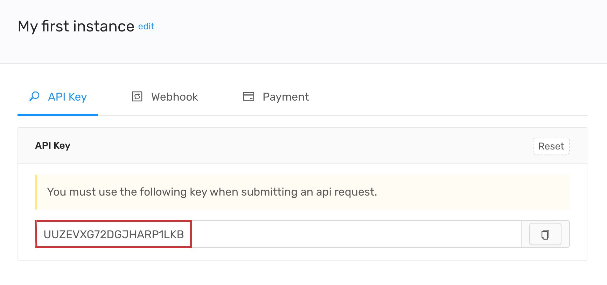

# Before you start

## What do I need to use the API?

All you need is to provide an Wapim API key. Please [**click**](https://app.wapim.io) to create a new API key.

## Please read the QR Code

You will see a QR code on the Wapim instance screen. Please read the QR code with WhatsApp.

1. Open WhatsApp on your phone.
2. Tap **Menu** or **Settings** and select **WhatsApp Web.**
3. Point your phone to this screen to capture the code.

## Can I use this API while offline?

No. To make the API fully functional, please always keep your phone online.

## Can I use WhatsApp Web and Wapim API at the same time?

Your phone should not be used for the WhatsApp Web at the same time.

## Important Warning❗️

Please do not spam with this API. If you spam, you can be banned by WhatsApp.

