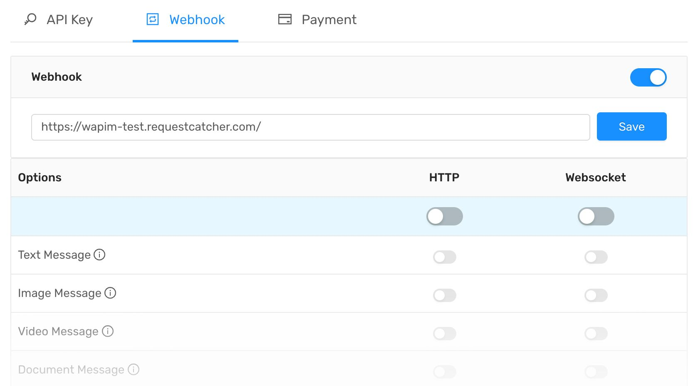

# Webhook

A webhook in web development is a method of augmenting or altering the behavior of a [web page](https://en.wikipedia.org/wiki/Web_page), or web application, with custom callbacks. These callbacks may be maintained, modified, and managed by third-party users and developers who may not necessarily be affiliated with the originating website or application. \([**Wikipedia**](https://en.wikipedia.org/wiki/Webhook)\)

You can setup webhook configuration on [**app.wapim.io**](https://app.wapim.io).  
  
There are two things you need to do. 

1. Define POST URL for Webhooks.
2. Choose what you want to be informed about.

### Event Types

| Event | Description |
| :--- | :--- |
| Text Message | When activated, you receive notifications about text messages. |
| Image Message | When activated, you receive notifications about image messages. |
| Video Message | When activated, you receive notifications about video messages. |
| Document Message | When activated, you receive notifications about document messages. |
| Audio Message | When activated, you receive notifications about audio messages. |
| Location Message | When activated, you receive notifications about location messages. |
| Live Location Message | When activated, you receive notifications about live location messages. |
| Contact Message | When activated, you receive notifications about contact messages. |
| Status Message | When activated, you receive notifications about status\(snap\) messages. |
| Battery | When activated, you receive information when phone battery status changes. |
| Photo Changes | Any one of the contact list sends notification when the photo changes. |
| Block | You receive notifications when you block someone. |
| Call Message | You will receive notification when the call starts, the call is in progress\(every 5 seconds\), and the call ends. |
| Acknowledge Delivered | This notification is sent when your message is delivered. |
| Acknowledge Readed | This notification is sent when your message is readed. |

