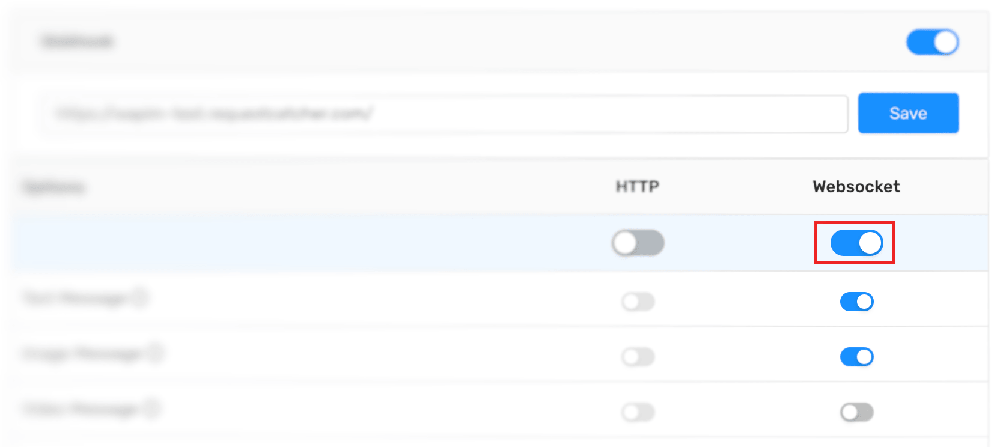

# WebSocket

WhatsApp API üzerinde real-time çalışmak istediğinizde Wapim size bir WebSocket bağlantısı sunar. Böylelikle hiçbir ek geliştirmeye gerek kalmadan WhatsApp hesabınız üzerindeki tüm güncellemeleri gerçek zamanlı olarak ekranlarınızda gösterebilirsiniz.


You can use this feature only with **Platinum** plan.



Make sure to enable WebSocket in the webhook settings on the [**Wapim Console**](https://app.wapim.io).




### Example Connection

Aşağıda çok basit bir HTML dökümanı hazırlıyoruz. WebSocket bağlantısı açıldığında, yeni bir mesaj alındığında, bağlantı kapandığında ve hata durumları için birer event oluşturuyoruz.

```markup
<html>
	<body>
		Hello Wapim WS
	</body>

	<script>
		let socket = new WebSocket('wss://api.wapim.io/ws?token=YOUR_WAPIM_TOKEN');

		socket.onopen = function(e) {
			console.log('[open] Connection established');
		};

		socket.onmessage = function(event) {
			console.log(`[message] Data received from server: ${event.data}`);
		};

		socket.onclose = function(event) {
			if (event.wasClean) {
				console.log(`[close] Connection closed cleanly, code=${event.code} reason=${event.reason}`);
			} else {
				// e.g. server process killed or network down
				// event.code is usually 1006 in this case
				console.log('[close] Connection died');
			}
		};

		socket.onerror = function(error) {
			console.log(`[error] ${error.message}`);
		};
	</script>
</html>
```

### What situations do I get notified about?


